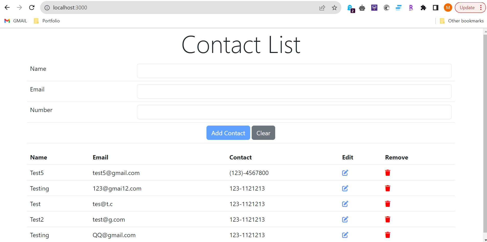
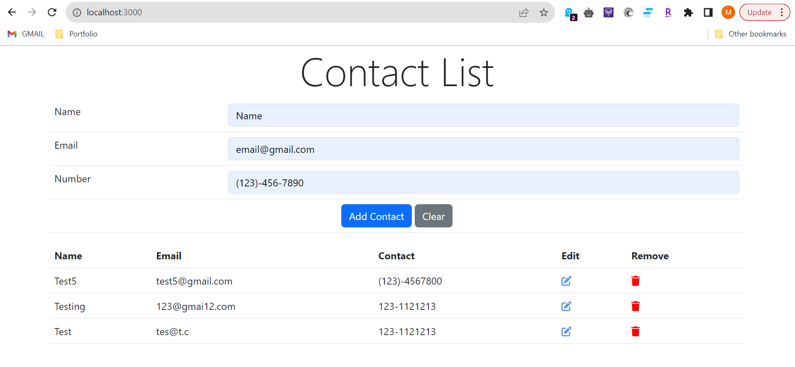
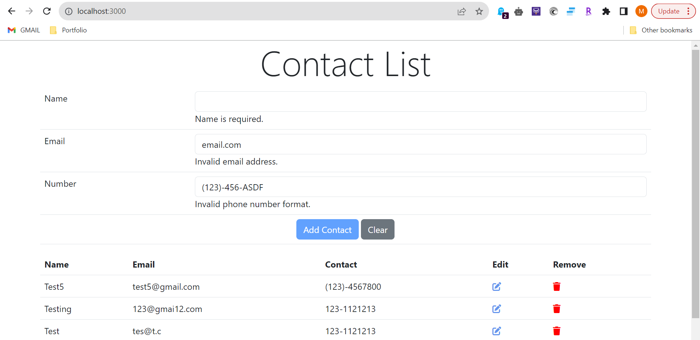
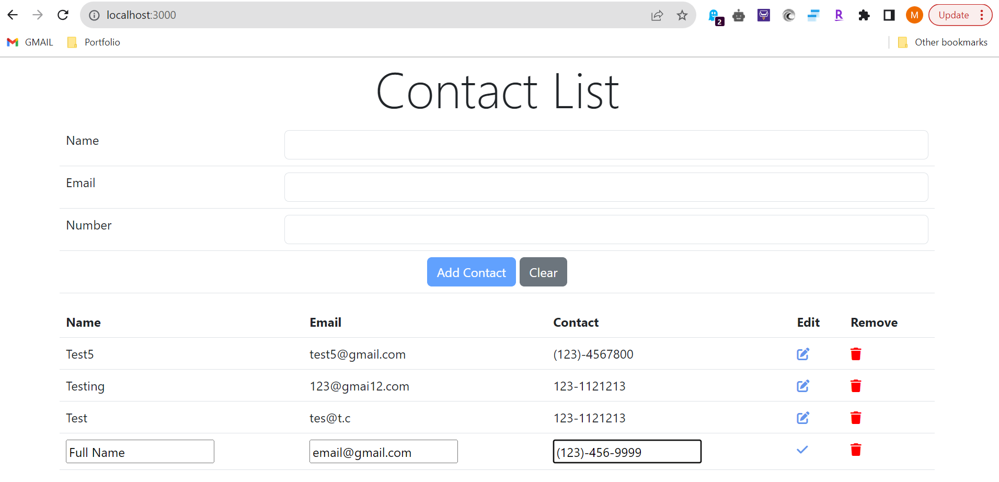
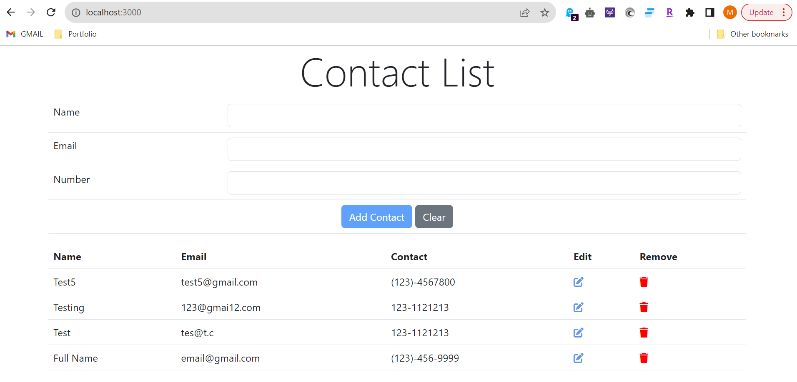
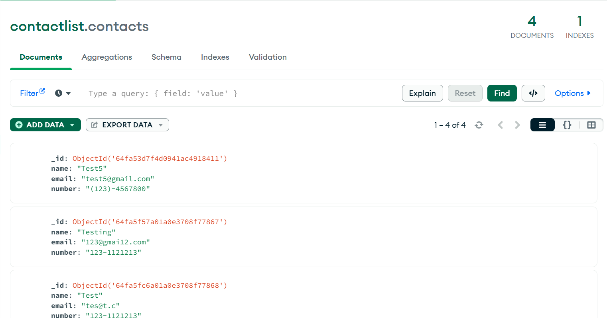

# Contact App
<p>
A MEAN stack based contact app that allows users to add, update, delete contacts and displays the updated list of contacts. Utilized MongoDB and Express.

## Current features:

Add Contact<br>
Edit Contact<br>
Remove Contact<br>
Check for validations<br>
Clear Form<br>

</p>

## Local Development

Setup you own MongoDB sever and configure following line in server.js

```
var db = mongojs('mongodb://127.0.0.1:27017/contactlist',['contactlist'])
```

Name the table as 'contacts' or modify all occurance of db.contacts with your table name.

Move to MEAN_contactList folder and run `node server.js` for a dev server.

Navigate to `http://localhost:3000/`. The application will **not** reload automatically if you change any of the source files.

## Snap Shots

1. Home Page 



2. Add Contact 



3. Validation Errors 



4. Edit Contact



5. Updated List



6. MongoDB Data

